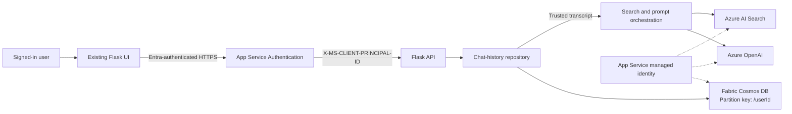

# Conversational Chat History for Azure App Service

Durable, per-user chat history for an existing Flask web application hosted on
Azure App Service. The implementation stores conversations, messages, and
feedback in Fabric Cosmos DB and rebuilds the model transcript on the server.

This repository is designed to integrate with the existing Metrolinx Flask app.
It is not a replacement web application.

## Why this change is needed

The current browser keeps the entire transcript in a JavaScript
`conversationHistory` array and sends it to `/api/chat`. That history:

- disappears when the page refreshes;
- cannot be reopened from another browser session; and
- can be edited by the browser before it reaches the model.

With this package, the browser stores only `activeConversationId`. App Service
loads the authoritative transcript from Cosmos before calling Azure OpenAI.

## Architecture



The detailed diagram is in
[`architecture/app-service-chat-history.mmd`](architecture/app-service-chat-history.mmd).

## Repository contents

| Path | Purpose |
| --- | --- |
| `chat_history/models.py` | Conversation, message, and feedback records |
| `chat_history/repository.py` | Synchronous storage contract and local in-memory repository |
| `chat_history/cosmos_repository.py` | Synchronous multi-item Cosmos implementation for Flask/Gunicorn |
| `chat_history/identity.py` | Easy Auth user identity and managed-identity credentials |
| `chat_history/flask_routes.py` | Flask blueprint for history APIs |
| `examples/metrolinx_app_integration.py` | Connects the existing Search and OpenAI logic to the blueprint |
| `examples/chat_history_client.js` | Browser API helper that stores only the active conversation ID |
| `scripts/create_container.py` | Creates the container with `/userId` as partition key |
| `tests/` | Ownership, persistence, API, feedback, and transcript tests |

## Integrate with the existing Flask app

### 1. Add dependencies

Add the lines from `requirements.txt` to the web app's existing requirements,
or install this package from source:

```powershell
python -m pip install -e .
```

The App Service startup command can remain:

```text
gunicorn --bind=0.0.0.0:8000 --timeout 600 app:app
```

### 2. Register the history routes

Copy `chat_history/` into the web application project. Then adapt the callback
from `examples/metrolinx_app_integration.py` and register it after the current
Search and OpenAI clients have been initialized:

```python
from examples.metrolinx_app_integration import register_chat_history

register_chat_history(
    app=app,
    openai_client=openai_client,
    deployment_name=AZURE_OPENAI_DEPLOYMENT,
    system_prompt=SYSTEM_PROMPT,
    search_knowledge_base=search_knowledge_base,
)
```

The callback receives a transcript loaded from server-side storage. Do not use
the `history` field supplied by the browser.

### 3. Change the browser integration

Use `examples/chat_history_client.js` from the current UI. Replace:

```javascript
let conversationHistory = [];
```

with a `ChatHistoryClient`. Create or open a conversation, then send only the
new message:

```javascript
const historyClient = new ChatHistoryClient();

await historyClient.create("PRESTO question");
const result = await historyClient.send("How do I reload my card?");
addMessage(result.assistantMessage.content, "assistant");
```

Render a history list from `await historyClient.list()`. Selecting an item calls
`historyClient.open(conversationId)` and returns all persisted messages.

### 4. Create the Cosmos container

Sign in with an identity allowed to manage the Fabric Cosmos database, set the
values in `.env.example`, and run:

```powershell
python -m pip install -e .
python scripts/create_container.py
```

The script uses an existing database and creates the `conversations` container
with partition key `/userId`.

## API contract

| Method | Route | Purpose |
| --- | --- | --- |
| `POST` | `/api/conversations` | Create a conversation and return its UUID |
| `GET` | `/api/conversations` | List the signed-in user's conversations |
| `GET` | `/api/conversations/{conversationId}` | Reopen one conversation |
| `POST` | `/api/conversations/{conversationId}/messages` | Save a user turn, generate a response, and save it |
| `PUT` | `/api/conversations/{conversationId}/messages/{messageId}/feedback` | Save or update response feedback |
| `DELETE` | `/api/conversations/{conversationId}` | Delete one conversation and its child items |

## Stored documents

All records for one user use the same `/userId` partition key.

```text
conversation
  id             = conversationId
  type           = conversation
  userId         = Entra principal ID

message
  id             = messageId
  type           = message
  conversationId = parent conversation
  userId         = same partition key

feedback
  id             = feedback-<messageId>
  type           = feedback
  conversationId = parent conversation
  messageId      = rated assistant response
  userId         = same partition key
```

Reads and queries always include `userId`. Knowing another user's
`conversationId` does not grant access to that conversation.

## App Service configuration

Configure these application settings:

```text
FABRIC_COSMOS_ENDPOINT=<endpoint>
FABRIC_COSMOS_DATABASE=GovernanceChatAnalytics
FABRIC_COSMOS_CONTAINER=conversations
```

For same-tenant access, enable the App Service managed identity and grant it the
required Cosmos data-plane permissions. Keep the existing permissions for:

- Azure AI Search: `Search Index Data Reader`;
- Azure OpenAI: `Cognitive Services OpenAI User`; and
- Fabric Cosmos DB: read and write access to the target database/container.

For cross-tenant Fabric access, configure all three settings:

```text
FABRIC_TENANT_ID=<fabric-tenant-id>
FABRIC_CLIENT_ID=<multi-tenant-app-registration-client-id>
FABRIC_MANAGED_IDENTITY_CLIENT_ID=<user-assigned-managed-identity-client-id>
```

Never place client secrets, connection keys, or local `.env` files in source
control.

## Authentication requirements

Enable App Service Authentication with Microsoft Entra ID and require
authentication for the application. Easy Auth supplies
`X-MS-CLIENT-PRINCIPAL-ID`; this becomes the data ownership key.

The local demo fallback is disabled by default. It can be enabled only for local
development:

```text
CHAT_HISTORY_ALLOW_DEMO_USER=true
CHAT_HISTORY_DEMO_USER_ID=local-developer
```

Do not enable the fallback in App Service.

## Networking

The UI and Flask APIs share the same App Service origin, so they do not require
CORS between each other. If APIM or another browser origin calls the APIs,
restrict CORS to the exact approved origins.

App Service VNet Integration controls outbound access to private Search,
OpenAI, or supported data endpoints. An App Service private endpoint controls
inbound access to the web app; it does not provide outbound connectivity.

Confirm the supported private connectivity model for the specific
`FABRIC_COSMOS_ENDPOINT` and tenant policy before disabling public access.

## Streaming responses

The included message route is non-streaming. For the existing SSE route:

1. save the user message before starting the stream;
2. load the transcript from the repository;
3. accumulate generated assistant text on the server;
4. save the assistant message when generation completes; and
5. define how partial responses are handled when the client disconnects.

## Test

```powershell
python -m pip install -e ".[test]"
python -m pytest -q
```

The test suite verifies user isolation, UUID relationships, partition-scoped
Cosmos operations, server-owned transcript reconstruction, feedback, and
conversation deletion.

## License

MIT License. See [`LICENSE`](LICENSE).